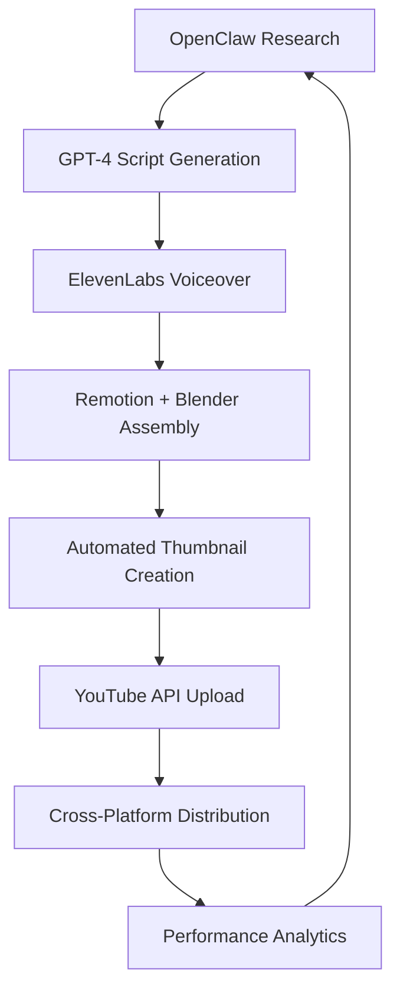

# 🔥 THE EMPIRE BLUEPRINT 🔥
## The Master Plan: From Ubuntu Server to Digital Agency Empire

*Written February 16, 2026*  
*The definitive strategic document for building an AI-powered business empire*

---

> **"Today's work is tomorrow's RTX 5090s. The flywheel only spins if we push it."**  
> — A ⚡, 2026

---

## PART 1: THE VISION

### WHERE WE ARE NOW (ASSETS AUDIT)

**Technical Infrastructure:**
- ✅ **Ubuntu Server (i7-12650H, 30GB RAM, RTX 3050 Ti)** - Our command center
- ✅ **OpenClaw AI Platform** - Advanced AI orchestration capability no competitor has
- ✅ **Blender 4.0.2** - 3D animation monopoly for content creation
- ✅ **n8n Self-Hosted** - Unlimited automation without per-workflow costs
- ✅ **Remotion Pipeline** - Programmatic video generation at infinite scale
- ✅ **Alpaca Trading Bot** - 10 strategies, +3.16% backtested performance, regime-adaptive
- ✅ **24/7 Always-On Infrastructure** - Continuous operation while competitors sleep

**Brand & Business Assets:**
- ✅ **Amotion** - Established educational brand with animation pipeline
- ✅ **Amotive** - Premium marketing agency ready for launch ($2.5K websites, $2K-3.5K/mo)
- ✅ **Domain Expertise** - AI, automation, marketing, 3D animation, trading systems
- ✅ **Pacific Northwest Market Position** - Pacific Northwest-based, US privacy-conscious, GDPR-compliant

**Competitive Advantages (Our Moat):**
1. **Technical Sophistication:** OpenClaw + custom automation beyond what agencies can buy
2. **3D Capabilities:** Blender animations nobody else in marketing space offers  
3. **Data Privacy:** Self-hosted = major EU competitive advantage
4. **Always-On Production:** 24/7 server enables global time zone optimization
5. **Trading Data:** Exclusive financial content source with proven performance
6. **Full-Stack Ability:** Can build anything we need vs. being tool-dependent

### WHERE WE'RE GOING (THE VISION)

**12-Month Revenue Targets:**
- **Month 3:** $5,000-8,000/month (Amotive + YouTube starting)
- **Month 6:** $10,000-15,000/month (Multiple revenue streams active)
- **Month 9:** $20,000-30,000/month (Content empire scaling, trading signals live)
- **Month 12:** $30,000-50,000/month (Full ecosystem operating)

**24-Month Vision:**
- **$50K-100K/month** across all revenue streams
- **RTX 5090 × 2** purchased from profits 
- **Dedicated server rack** - Professional infrastructure
- **Team of 5-10** VAs and specialists
- **Market leadership** in AI-powered marketing in the Pacific Northwest
- **Exit opportunities** - Acquisition offers or IPO preparation

**The Ultimate Goal:**
Build a self-sustaining AI empire that generates wealth while we sleep, funds the hardware we dream of, and positions us as thought leaders in the convergence of AI, automation, and business growth.

### WHY WE WILL WIN

**1. Technical Timing**
- AI tools mature enough for serious business use
- Most competitors still using consumer-grade solutions
- We have infrastructure advantages they can't quickly replicate

**2. Market Positioning**  
- US privacy-conscious concerns and GDPR-compliant operations create competitive moat
- Pacific Northwest market underserved by technical AI agencies
- Financial regulations favor local, compliant solutions

**3. Unique Asset Combination**
- Nobody else has: OpenClaw + Blender + Trading data + Always-on server + EU compliance
- Most "AI agencies" are just ChatGPT + Canva + Buffer
- Our technical depth creates premium positioning and pricing power

**4. Revenue Stream Diversification**
- Not dependent on single business model
- Multiple monetization paths for same technical assets
- Network effects between different revenue streams

**5. Automation-First Approach**
- True scalability through systems, not just people
- Profit margins 2-3x higher than traditional agencies
- Can operate globally without proportional cost increases

---

## PART 2: REVENUE STREAMS (RANKED BY SPEED TO MONEY)

### STREAM 1: AMOTIVE MARKETING AGENCY (FASTEST - LAUNCH IMMEDIATELY)

**What It Is:**
Premium AI-powered marketing agency serving local businesses in the Pacific Northwest with websites, social media management, Google Ads, and comprehensive growth systems.

**Revenue Potential:**
- **Realistic Year 1:** $12,000-25,000/month
- **Optimistic Year 1:** $30,000-50,000/month  
- **Year 2 Potential:** $50,000+/month

**Time to First Dollar:** 2-4 weeks
**Startup Cost:** $3,000-5,000
**Risk Level:** LOW (Proven demand, immediate cashflow)

**Our Specific Advantages:**
- **OpenClaw orchestration** - Automation no competitor can match
- **3D Blender content** - Visual differentiation worth premium pricing
- **US privacy-conscious infrastructure** - Major selling point for Pacific Northwest businesses
- **Full technical control** - Can build custom solutions vs. tool limitations
- **Trading data insights** - Unique content for financial services clients

**Revenue Breakdown:**
- **Website Design:** $2,500 one-time (target: 1-2 per month = $2.5-5K)
- **Marketing Partnership:** $2,000/month (target: 3-5 clients = $6-10K)
- **Full Growth System:** $3,500/month (target: 2-4 clients = $7-14K)
- **Total Month 12:** $15-25K/month recurring + $2.5-5K one-time projects

**Step-by-Step Implementation:**

**Week 1-2: Foundation**
- [ ] Complete Amotive website with 3D elements and case studies
- [ ] Set up n8n automation workflows for client onboarding
- [ ] Create Pacific Northwest market client acquisition system
- [ ] Develop pricing and proposal templates
- [ ] Launch Google Maps prospecting system (25-30 businesses daily)

**Week 3-4: First Clients**
- [ ] Execute cold outreach to 200+ no-website Pacific Northwest businesses  
- [ ] Schedule 8-10 discovery calls
- [ ] Close 2-3 clients to start building case studies
- [ ] Set up client portal and reporting systems
- [ ] Begin social media content showcasing work

**Month 2-3: Systematization**
- [ ] Refine service delivery automation (80% hands-off)
- [ ] Build referral partnership network
- [ ] Create content marketing funnel
- [ ] Target 8-12 active clients generating $8-20K/month
- [ ] Document all processes for scaling

**Scaling Strategy:**
1. **Months 4-6:** Scale to 15-20 clients through systematized outreach and referrals
2. **Months 7-9:** Add premium services, increase average client value to $3,000+
3. **Months 10-12:** Hire VA team, expand to Tacoma/Spokane markets
4. **Year 2:** White-label platform licensing, franchise model consideration

**Critical Success Factors:**
- Premium positioning vs. commoditized competition
- Pacific Northwest business culture relationship-building
- Consistent delivery quality through automation
- Strong case studies and referral generation

### STREAM 2: FACELESS CONTENT EMPIRE (HIGH SCALABILITY - LAUNCH MONTH 1)

**What It Is:**
Network of 10+ faceless YouTube channels plus TikTok/Instagram content using AI scripts, Blender animations, and Remotion automation.

**Revenue Potential:**
- **Realistic Year 1:** $3,000-8,000/month
- **Optimistic Year 1:** $15,000-30,000/month
- **Year 2 Potential:** $50,000+/month (with viral success)

**Time to First Dollar:** 4-8 months (YouTube monetization timeline)
**Startup Cost:** $1,000-2,000
**Risk Level:** MEDIUM (Algorithm dependent, but diversified across platforms)

**Our Specific Advantages:**
- **Blender 3D animations** - Unique visual content competitors can't replicate
- **Remotion automation** - Programmatic video generation at unlimited scale  
- **OpenClaw orchestration** - Complete pipeline automation from research to publish
- **Trading bot data** - Exclusive financial content source
- **Amotion brand synergy** - Educational authority for science content
- **24/7 server** - Continuous rendering and publishing while we sleep

**Channel Portfolio Strategy:**

**Tier 1: Premium Educational (Amotion Synergy)**
- **Science Explanations** with custom Blender animations
- **Target:** 8-20 minute deep dives, premium CPM ($5-12 per 1K views)
- **Monetization:** AdSense + course sales + consulting
- **Volume:** 2-3 videos/week

**Tier 2: Financial Authority (Trading Data)**
- **Market Analysis** using our bot's real data and predictions
- **Target:** Daily/weekly analysis, high-value audience ($15-30 per 1K views)  
- **Monetization:** Premium subscriptions + signal services + affiliate
- **Volume:** 3-5 videos/week

**Tier 3: Mass Market Entertainment**
- **Horror/Mystery, Top Lists, Motivation** using proven formats
- **Target:** High volume, viral potential ($3-8 per 1K views)
- **Monetization:** AdSense + affiliate marketing
- **Volume:** 5-10 videos/week across multiple channels

**Production Pipeline (Fully Automated):**

**Content Calendar:**
- **Monday:** Finance focus (trading data)
- **Tuesday:** Educational (Amotion synergy)  
- **Wednesday:** Entertainment/viral
- **Thursday:** Technology/AI news
- **Friday:** Motivational/success
- **Weekend:** Compilation content

**Revenue Projections:**
- **Month 6:** 5 channels, 500K total monthly views = $1,000-3,000
- **Month 12:** 10 channels, 2M total monthly views = $3,000-8,000
- **Year 2:** 15+ channels, 10M+ monthly views = $15,000-50,000+

**Monetization Stack:**
- **YouTube AdSense:** Primary revenue stream
- **Affiliate Marketing:** Finance, tech, education products  
- **Sponsorships:** Brand deals for established channels
- **Course Sales:** Educational content leads to paid courses
- **Newsletter Signups:** Email list building for other revenue streams

**Implementation Timeline:**
- **Week 1:** Set up Remotion templates and Blender automation
- **Week 2:** Launch first channel (Financial Analysis using trading data)
- **Month 1:** Add 2-3 more channels, perfect automation pipeline
- **Month 3:** Scale to 5-7 channels, optimize for monetization  
- **Month 6:** Full network operational, pursuing sponsorship deals

### STREAM 3: AI TRADING SIGNALS & FINTECH SERVICES (HIGH VALUE AUDIENCE)

**What It Is:**
Monetize our existing 10-strategy trading bot through signals, copy trading, educational content, and financial SaaS products.

**Revenue Potential:**
- **Realistic Year 1:** $3,000-8,000/month
- **Optimistic Year 1:** $10,000-25,000/month
- **Year 2 Potential:** $30,000+/month

**Time to First Dollar:** 2-3 months (after building track record)
**Startup Cost:** $5,000-10,000 (legal compliance)
**Risk Level:** MEDIUM (Regulatory complexity, performance dependent)

**Our Specific Advantages:**
- **Existing 10-strategy system** with +3.16% backtested performance
- **Regime-adaptive meta layer** - sophistication competitors lack
- **Real trading data** for content creation and social proof
- **US privacy-conscious infrastructure** - regulatory advantage
- **Technical depth** for custom platform development

**Service Tiers:**

**Tier 1: Free Signal Channel (Lead Generation)**
- 2-3 signals per week on Telegram
- Basic strategy explanations
- Community building and social proof
- Target: 1,000+ subscribers by month 6

**Tier 2: Premium Signals ($99-199/month)**
- Daily signals with entry/exit/reasoning
- Real-time alerts via multiple channels
- Strategy performance breakdowns
- Target: 200-500 subscribers by year 1

**Tier 3: Copy Trading Platform ($299-999/month)**
- Automated position copying
- Risk management controls
- Performance attribution
- Target: 50-200 copiers by year 1

**Tier 4: Institutional Services**
- Custom strategy development: $10K-50K
- Algorithm licensing: $5K-25K/month
- Consulting services: $500-1,000/hour

**Implementation Strategy:**

**Phase 1: Social Proof Building (Months 1-3)**
- [ ] Document 90-day public paper trading campaign
- [ ] Create daily content showing trades and analysis
- [ ] Build social media following across platforms
- [ ] Establish third-party performance verification

**Phase 2: Signal Service Launch (Months 4-6)**
- [ ] Launch freemium Telegram channel
- [ ] Build premium subscription platform  
- [ ] Create automated alert systems
- [ ] Develop customer support infrastructure

**Phase 3: Copy Trading Platform (Months 7-12)**
- [ ] Develop or integrate copy trading technology
- [ ] Obtain necessary financial licenses
- [ ] Launch beta with select subscribers
- [ ] Scale to broader market with proven results

**Revenue Projections:**
- **Month 6:** 500 free + 50 premium subscribers = $2,000-5,000
- **Month 12:** 2,000 free + 300 premium + 50 copy trading = $8,000-15,000
- **Year 2:** 10,000 free + 1,000 premium + 200 copy trading = $25,000-50,000+

**Compliance Strategy:**
- Partner with licensed entity initially
- Apply for necessary licenses when revenue justifies
- Focus on education and general signals vs. personalized advice
- Maintain clear disclaimers and risk warnings

### STREAM 4: OPENCLAW CONSULTING & SKILLS MARKETPLACE

**What It Is:**
Monetize our unique OpenClaw expertise through consulting, custom automation development, and skills marketplace participation.

**Revenue Potential:**
- **Realistic Year 1:** $2,000-5,000/month  
- **Optimistic Year 1:** $8,000-15,000/month
- **Year 2 Potential:** $20,000+/month

**Time to First Dollar:** 2-4 weeks
**Startup Cost:** $500-1,000
**Risk Level:** LOW (Direct expertise monetization)

**Our Specific Advantages:**
- **Deep OpenClaw expertise** - among first wave of power users
- **Proven automation systems** - working infrastructure to showcase
- **Technical implementation ability** - can build custom solutions
- **Multi-language capability** - serve Pacific Northwest and international markets

**Service Offerings:**

**Consulting Services:**
- **OpenClaw implementation:** $2,000-10,000 per project
- **Custom automation development:** $100-300/hour
- **AI workflow optimization:** $5,000-25,000 per engagement
- **Training and workshops:** $1,000-5,000 per session

**ClawHub Skills Development:**
- **Premium skills:** $50-500 per skill
- **Enterprise integrations:** $1,000-10,000 per skill
- **White-label solutions:** $5,000-50,000 licensing
- **Support contracts:** $500-5,000/month per client

**Managed OpenClaw Services:**
- **Fully managed instances:** $500-2,000/month per client
- **Monitoring and maintenance:** $200-1,000/month per instance
- **Custom development:** $150-400/hour ongoing
- **24/7 support packages:** $1,000-5,000/month

**Target Markets:**
- **Pacific Northwest SMBs** - US privacy-conscious AI automation
- **Marketing agencies** - white-label AI capabilities
- **Tech startups** - rapid automation deployment
- **Enterprise** - custom AI workflow development

**Implementation Timeline:**
- **Week 1:** Create OpenClaw consulting website and portfolio
- **Week 2:** Submit skills to ClawHub marketplace
- **Month 1:** Launch managed services offering
- **Month 3:** Establish enterprise relationships
- **Month 6:** Scale through partner network

### STREAM 5: AI SAAS / MICRO-SAAS PRODUCTS

**What It Is:**
Leverage our technical capabilities to build and launch AI-powered SaaS tools serving specific niches.

**Revenue Potential:**
- **Realistic Year 1:** $1,000-3,000/month
- **Optimistic Year 1:** $5,000-15,000/month  
- **Year 2 Potential:** $25,000+/month (if product-market fit achieved)

**Time to First Dollar:** 3-6 months
**Startup Cost:** $2,000-5,000
**Risk Level:** HIGH (Market validation, longer development cycles)

**Our Specific Advantages:**
- **Full-stack development capability** - can build anything we design
- **AI integration expertise** - advanced implementations beyond basic wrappers
- **US market focus** - privacy-conscious and GDPR-compliant from inception
- **Automation infrastructure** - can build highly efficient operations

**Product Opportunities (Prioritized):**

**1. AI-Powered Local Business Marketing Dashboard**
- **Target:** Pacific Northwest marketing agencies and consultants
- **Problem:** Managing multiple clients across platforms
- **Solution:** Unified dashboard with AI insights and automation
- **Pricing:** $99-299/month per agency
- **Development:** 2-3 months

**2. Blender + AI Content Creation Tool**
- **Target:** Content creators needing 3D animations
- **Problem:** Blender learning curve vs. quality output needed
- **Solution:** AI-guided 3D content creation with templates
- **Pricing:** $49-199/month subscription
- **Development:** 3-4 months

**3. Trading Signal Analysis Platform**
- **Target:** Retail traders and small funds
- **Problem:** Signal quality assessment and performance tracking
- **Solution:** AI-powered signal analysis and portfolio optimization
- **Pricing:** $99-499/month depending on features
- **Development:** 4-6 months

**Implementation Strategy:**
1. **Validate with existing clients** - Use Amotive clients for feedback
2. **Build MVP quickly** - 4-6 week development cycles
3. **Launch on Product Hunt** - US time zone advantage
4. **Iterate based on usage** - Data-driven feature development
5. **Scale through content marketing** - Leverage existing channels

### STREAM 6: AI CONTENT PRODUCTS & EDUCATION

**What It Is:**
Create and sell educational content, courses, newsletters, and digital products leveraging our AI and automation expertise.

**Revenue Potential:**
- **Realistic Year 1:** $1,000-4,000/month
- **Optimistic Year 1:** $5,000-12,000/month
- **Year 2 Potential:** $15,000+/month

**Time to First Dollar:** 1-2 months
**Startup Cost:** $500-1,500
**Risk Level:** LOW (Direct expertise monetization, multiple price points)

**Our Specific Advantages:**
- **Unique technical knowledge** - OpenClaw + Blender + AI combinations
- **Proven systems** - Can teach what actually works
- **Multi-language capability** - Pacific Northwest and English markets
- **Content automation** - Can produce at scale

**Product Portfolio:**

**Newsletter Products:**
- **"AI Automation Weekly"** - $15-30/month, business automation insights
- **"Pacific Northwest Tech Digest"** - $10-25/month, local market focus
- **"Content Creator AI Tools"** - $20-40/month, practical tutorials

**Digital Courses:**
- **"OpenClaw Mastery"** - $497-997, comprehensive automation training
- **"AI Agency Blueprint"** - $297-697, agency building system
- **"Blender + AI Content Creation"** - $197-497, unique skill combination
- **"Pacific Northwest Business AI"** - $397-797, local market specialization

**High-Value Offers:**
- **"Done-With-You Agency Launch"** - $2,997-7,997, 12-week program
- **"Custom Automation Bootcamp"** - $1,997-4,997, intensive training
- **"AI Business Mastermind"** - $297-997/month, ongoing community

**Content Creation Pipeline:**
- **Blog content** - SEO-optimized articles driving course sales
- **YouTube tutorials** - Free content building authority and funnel
- **LinkedIn articles** - B2B audience development
- **Podcast appearances** - Thought leadership and backlinks

**Implementation Timeline:**
- **Month 1:** Launch newsletter and first mini-course
- **Month 2:** Create comprehensive flagship course
- **Month 3:** Develop mastermind/community offering
- **Month 6:** Scale through affiliate partnerships and joint ventures

### REVENUE STREAM SYNERGIES & NETWORK EFFECTS

**Cross-Pollination Opportunities:**

**Amotive → Content Empire**
- Client case studies become YouTube content
- Marketing expertise creates better performing channels
- 3D capabilities differentiate all content

**Trading Signals → Financial Content**
- Real performance data for credible financial YouTube
- Signal subscribers become course customers
- Content audience becomes signal prospects

**OpenClaw Skills → SaaS Products**
- Consulting clients become beta testers
- Custom work becomes productized solutions
- Technical reputation drives SaaS adoption

**Content Empire → Education Products**
- YouTube audience becomes course customers
- Educational content builds trust for high-value offers
- Video content becomes course materials

**All Streams → Personal Brand**
- Everything builds authority and credibility
- Cross-promotion between audiences
- Premium positioning enables higher prices across all services

---

## PART 3: THE TECH STACK

### CURRENT INFRASTRUCTURE (WHAT WE HAVE)

**Core Platform:**
- ✅ **Ubuntu 24.04 Server** - Always-on, reliable foundation
- ✅ **OpenClaw** - AI orchestration and workflow automation  
- ✅ **n8n (Self-Hosted)** - Unlimited automation workflows
- ✅ **Blender 4.0.2** - 3D animation and rendering
- ✅ **Remotion** - Programmatic video generation
- ✅ **Trading Bot Infrastructure** - 10 strategies, Alpaca integration

**Development Environment:**
- ✅ **Node.js v22.22.0** - Modern JavaScript runtime
- ✅ **Python 3.x** - AI/ML and automation scripts
- ✅ **FFmpeg** - Video processing capabilities
- ✅ **TinyTeX** - Document generation
- ✅ **Git** - Version control and deployment

### INFRASTRUCTURE SCALING PLAN

**Phase 1: Optimization (Months 1-3)**
- [ ] **Memory upgrade to 64GB** - Handle multiple concurrent AI workflows
- [ ] **Storage expansion to 4TB** - Video content and backup requirements
- [ ] **Network optimization** - Dedicated IP, improved bandwidth
- [ ] **Backup systems** - Automated cloud backup for critical data

**Phase 2: Expansion (Months 4-9)**
- [ ] **Second server acquisition** - Dedicated rendering and backup
- [ ] **GPU upgrade planning** - RTX 5090 specifications and availability
- [ ] **Professional networking** - Managed switches, redundancy
- [ ] **Monitoring systems** - Comprehensive uptime and performance tracking

**Phase 3: Professional Setup (Months 10-12)**
- [ ] **RTX 5090 × 2 Installation** - Ultimate rendering and AI capabilities
- [ ] **Dedicated server rack** - Professional equipment organization
- [ ] **UPS systems** - Power backup for critical operations
- [ ] **Professional cooling** - Maintain performance under load

### AI MODEL STRATEGY & COSTS

**Primary AI Services:**
- **OpenAI GPT-4o:** $15-$30/month for content generation (estimated usage)
- **Claude Sonnet:** $20-$40/month for analysis and reasoning
- **ElevenLabs:** $22-$99/month for voice generation (Creator to Pro tier)
- **Runway ML:** $76/month for video generation (Unlimited plan)
- **Midjourney:** $30-$60/month for image/thumbnail generation

**Cost Management:**
- **Budget allocation:** $200-$400/month AI services initially
- **Usage monitoring:** Track ROI per service, optimize spend
- **Scaling strategy:** Increase budgets as revenue grows
- **Fallback plans:** Self-hosted models for cost-sensitive workflows

### AUTOMATION PLATFORM COMPARISON

**n8n (Current Choice - OPTIMAL)**
- **Cost:** $0/month (self-hosted)
- **Capabilities:** Unlimited workflows, custom logic, AI integration
- **Advantages:** No usage limits, full control, extensive integration library
- **Best for:** Our technical capability and cost-conscious scaling

**Alternative Platforms:**
- **Make.com:** $18-$34/month, user-friendly but usage limited
- **Zapier:** $29-$73/month, popular but expensive at scale
- **Consider:** If non-technical team members need access

### CLIENT SERVICE DELIVERY STACK

**CRM & Project Management:**
- **HubSpot CRM (Free):** Client relationship management
- **ClickUp:** $7/user/month, project management and client portals
- **Calendly:** $10/month, professional scheduling

**Client Reporting & Dashboards:**
- **Custom dashboard development** - Using our technical capabilities
- **Google Data Studio:** Free, client-accessible reporting
- **Supermetrics:** $99/month when client volume justifies

**Communication & Support:**
- **WhatsApp Business:** Client communication, especially Pacific Northwest market
- **Slack:** Team communication and client channels
- **Loom:** Video explanations and training

### MARKETING & CONTENT CREATION STACK

**Content Creation:**
- **Blender 4.0.2** - 3D animation and modeling (competitive advantage)
- **Remotion** - Programmatic video generation
- **Canva Pro:** $12/month, quick graphics and templates
- **Adobe Creative Suite:** $60/month if advanced needs develop

**Social Media Management:**
- **Later:** $25/month, visual content calendar
- **Buffer:** $15/month, multi-platform scheduling
- **Hootsuite:** $99/month if enterprise features needed

**SEO & Analytics:**
- **Ahrefs:** $129/month for serious SEO efforts
- **SEMrush:** $119/month, comprehensive marketing analytics
- **Google Analytics & Search Console:** Free, essential tracking

### FINANCIAL & BUSINESS OPERATIONS

**Accounting & Invoicing:**
- **FreshBooks:** $12/month, professional invoicing and time tracking
- **Wave:** Free accounting software for simple needs
- **Accountant:** $100-200/month for tax compliance

**Payment Processing:**
- **Stripe:** 2.9% + $0.30 per transaction, international capability
- **PayPal:** Similar rates, familiar to clients
- **ACH/wire transfer:** For local clients preferring bank transfer

**Legal & Compliance:**
- **Legal insurance:** $200-400/year for professional protection
- **Contract templates:** One-time legal investment for all service tiers
- **GDPR compliance tools:** Built into self-hosted infrastructure

### TOTAL MONTHLY TECHNOLOGY COSTS

**Essential Stack (Months 1-6):**
- AI Services: $200-$400
- Business Software: $100-$200  
- Marketing Tools: $50-$150
- Professional Services: $150-$300
- **Total: $500-$1,050/month**

**Growth Stack (Months 7-12):**
- AI Services: $400-$800
- Business Software: $200-$400
- Marketing Tools: $200-$500
- Professional Services: $300-$500
- **Total: $1,100-$2,200/month**

**Scale Stack (Year 2+):**
- AI Services: $800-$1,500
- Business Software: $500-$1,000
- Marketing Tools: $500-$1,000  
- Professional Services: $500-$1,000
- Hardware Upgrades: $1,000-$2,000/month (amortized)
- **Total: $3,300-$6,500/month**

### API INTEGRATION PRIORITY ORDER

**Phase 1 Integrations (Month 1):**
1. **Google Ads API** - Core Amotive service delivery
2. **Meta/Instagram Graph API** - Social media management automation  
3. **YouTube Data API** - Content empire infrastructure

**Phase 2 Integrations (Month 2-3):**
4. **Google Business Profile API** - Local business optimization
5. **TikTok Marketing API** - Short-form content distribution
6. **Email Marketing APIs** - ConvertKit/Mailchimp automation

**Phase 3 Integrations (Month 4-6):**
7. **Financial Data APIs** - Trading signal enhancement
8. **Analytics APIs** - Comprehensive reporting dashboards
9. **CRM Integrations** - Complete client management automation

### BACKUP & SECURITY STRATEGY

**Data Protection:**
- **Daily automated backups** to cloud storage (encrypted)
- **Weekly full system snapshots** for disaster recovery
- **Monthly backup testing** to ensure restoration capability
- **Geographic distribution** - EU and US backup locations

**Security Measures:**
- **SSL certificates** for all public-facing services
- **VPN access** for remote management
- **Two-factor authentication** on all critical accounts
- **Regular security updates** and vulnerability scanning

**Business Continuity:**
- **Redundant internet connections** for uptime guarantee
- **UPS systems** for power outage protection
- **Hot-swap capabilities** for critical hardware components
- **Disaster recovery procedures** documented and tested

---

## PART 4: THE 12-MONTH ROADMAP

### MONTH 1: FOUNDATION & LAUNCH 🚀

**Week 1: Infrastructure & Setup**
- [ ] Complete Amotive website with 3D elements and case studies
- [ ] Set up comprehensive client acquisition system (Google Maps, social media, networking)
- [ ] Launch n8n automation workflows for client onboarding and service delivery
- [ ] Begin systematic Pacific Northwest market prospecting (25-30 businesses daily)
- [ ] Set up content creation pipeline (Remotion templates, Blender automation)

**Week 2: First Revenue Generation**
- [ ] Execute cold outreach campaign to 200+ Washington State businesses
- [ ] Schedule and conduct 8-10 discovery calls using sales playbook
- [ ] Launch first faceless YouTube channel (Financial Analysis using trading data)
- [ ] Begin daily social media content showcasing capabilities
- [ ] Close 2-3 initial Amotive clients for case study development

**Week 3: System Optimization**
- [ ] Refine service delivery workflows based on initial client feedback  
- [ ] Set up client reporting and communication systems
- [ ] Launch second YouTube channel (Educational content with Blender animations)
- [ ] Establish professional networking presence (BNI, Chamber of Commerce)
- [ ] Create referral partnership agreements with complementary businesses

**Week 4: Scaling Preparation**
- [ ] Document all successful processes for replication
- [ ] Launch third YouTube channel (Entertainment/viral content)
- [ ] Set up email marketing funnels for lead nurturing
- [ ] Begin building social media following across platforms
- [ ] Prepare Month 2 expansion plans

**Month 1 Targets:**
- **Revenue:** $5,000-$10,000 (3-5 Amotive clients + 2-3 website projects)
- **Clients:** 5-8 total active clients
- **Content:** 3 YouTube channels launched, 20+ videos published
- **Systems:** Core automation workflows operational
- **Pipeline:** 50+ warm prospects for Month 2 expansion

### MONTH 2: SCALING & SYSTEMATIZATION 📈

**Week 5-6: Service Expansion**
- [ ] Scale Amotive to 8-12 active clients through systematic outreach
- [ ] Launch trading bot public paper trading campaign (90-day social proof building)
- [ ] Add 2-3 more YouTube channels to content network  
- [ ] Implement advanced client service automation (90% hands-off delivery)
- [ ] Begin OpenClaw consulting service promotion

**Week 7-8: Revenue Diversification**  
- [ ] Launch first newsletter (AI Automation Weekly)
- [ ] Create and sell first digital product (OpenClaw automation guide - $97)
- [ ] Set up affiliate marketing partnerships for content monetization
- [ ] Begin development of Pacific Northwest market AI course
- [ ] Establish premium pricing for new Amotive clients

**Month 2 Targets:**
- **Revenue:** $12,000-$20,000 (10-15 Amotive clients + digital products)
- **Content Network:** 5-6 YouTube channels, consistent posting schedule
- **Automation Level:** 80% of client work automated
- **New Revenue Streams:** Newsletter + digital products launched
- **Social Proof:** Strong case studies and client testimonials

### MONTH 3: OPTIMIZATION & PREMIUM POSITIONING 💎

**Week 9-10: Premium Services Launch**
- [ ] Launch $3,500/month Full Growth System package for Amotive
- [ ] Complete first comprehensive case study with ROI documentation
- [ ] Scale content empire to 8-10 channels across all major niches
- [ ] Begin advanced OpenClaw consulting projects ($5K+ engagements)
- [ ] Implement advanced analytics and reporting systems

**Week 11-12: Market Leadership Establishment**
- [ ] Publish thought leadership content on LinkedIn and industry publications
- [ ] Launch Pacific Northwest Business AI mastermind ($297/month)
- [ ] Complete trading bot social proof campaign, prepare signal service launch
- [ ] Scale YouTube network to 1M+ total monthly views
- [ ] Hire first virtual assistant for content and administrative tasks

**Month 3 Targets:**
- **Revenue:** $18,000-$25,000 (15+ Amotive clients + multiple income streams)
- **Premium Positioning:** $3,500/month clients acquired
- **Content Performance:** YouTube monetization achieved, sponsorship inquiries
- **Team Building:** VA hired and trained
- **Market Position:** Recognized as leading AI marketing expert in the Pacific Northwest

### MONTH 4-6: EXPANSION & DIVERSIFICATION 🌟

**Key Objectives:**
- Scale Amotive to 20+ clients generating $40K+ monthly recurring
- Launch trading signal service with 100+ premium subscribers
- Achieve YouTube monetization across all channels
- Launch first major educational course ($997 price point)
- Expand team to 3-4 VAs and specialists

**Quarter Focus Areas:**
1. **Geographic Expansion** - Tacoma, Olympia, Algarve markets
2. **Service Premium-ization** - Average client value $3,000+/month
3. **Content Monetization** - Ad revenue + sponsorships + affiliate income
4. **Product Development** - Complete course ecosystem launch
5. **System Automation** - 95% automated service delivery

**Revenue Target:** $35,000-$50,000/month

### MONTH 7-9: PLATFORM BUILDING & SCALING 🏗️

**Key Objectives:**
- Build proprietary SaaS platform for marketing automation
- Launch copy trading service with regulatory compliance
- Scale content network to 10M+ monthly views
- Develop white-label agency solutions
- Establish thought leadership speaking engagements

**Strategic Initiatives:**
1. **Technology Platform** - Custom SaaS development and launch
2. **Financial Services** - Trading signals and copy trading platform
3. **Content Scaling** - Professional production team and systems
4. **Partnership Development** - Strategic alliances and joint ventures
5. **International Expansion** - English-speaking markets

**Revenue Target:** $60,000-$80,000/month

### MONTH 10-12: DOMINANCE & OPTIMIZATION 👑

**Key Objectives:**
- Achieve $100K+ monthly recurring revenue
- Launch acquisition or franchise opportunities
- Complete hardware upgrade to dual RTX 5090s
- Establish market leadership position
- Build exit-ready business systems

**Transformation Goals:**
1. **Revenue Optimization** - $1M+ annual run rate achieved
2. **Market Leadership** - Industry recognition and speaking opportunities
3. **System Completion** - Fully automated, scalable operations
4. **Team Scaling** - 8-10 person organization
5. **Exit Preparation** - Business positioned for acquisition or expansion capital

**Revenue Target:** $100,000+/month

### SEASONAL CONSIDERATIONS FOR PACIFIC NORTHWEST MARKET

**Q1 (Jan-Mar): Planning Season**
- Focus on B2B services and yearly planning clients
- Landscaping and outdoor businesses preparing for spring
- Strong conversion rates for new initiatives

**Q2 (Apr-Jun): Implementation Season**
- Best client acquisition period
- Outdoor service business ramp-up
- Maximum conversion opportunity

**Q3 (Jul-Sep): Maintenance Season**
- August slowdown accommodation
- Focus on non-tourist local businesses
- Content creation and system building

**Q4 (Oct-Dec): Reflection & Planning**
- Year-end budgets available
- Planning for next year initiatives  
- Premium service positioning

---

## PART 5: FINANCIAL PROJECTIONS

### MONTHLY REVENUE TARGETS BY SCENARIO

**CONSERVATIVE SCENARIO (High Probability)**

| Month | Amotive MRR | Content | Trading | Other | Total |
|-------|-------------|---------|---------|-------|-------|
| M1 | $8,000 | $0 | $0 | $1,000 | $9,000 |
| M2 | $15,000 | $500 | $0 | $2,000 | $17,500 |
| M3 | $22,000 | $1,500 | $0 | $3,500 | $27,000 |
| M6 | $35,000 | $5,000 | $3,000 | $7,000 | $50,000 |
| M9 | $45,000 | $8,000 | $8,000 | $12,000 | $73,000 |
| M12 | $55,000 | $12,000 | $15,000 | $18,000 | $100,000 |

**MODERATE SCENARIO (Target Performance)**

| Month | Amotive MRR | Content | Trading | Other | Total |
|-------|-------------|---------|---------|-------|-------|
| M1 | $10,000 | $0 | $0 | $2,000 | $12,000 |
| M2 | $20,000 | $1,000 | $0 | $4,000 | $25,000 |
| M3 | $30,000 | $3,000 | $2,000 | $8,000 | $43,000 |
| M6 | $50,000 | $10,000 | $8,000 | $15,000 | $83,000 |
| M9 | $70,000 | $18,000 | $20,000 | $25,000 | $133,000 |
| M12 | $90,000 | $30,000 | $35,000 | $45,000 | $200,000 |

**AGGRESSIVE SCENARIO (Optimal Execution)**

| Month | Amotive MRR | Content | Trading | Other | Total |
|-------|-------------|---------|---------|-------|-------|
| M1 | $15,000 | $500 | $0 | $3,500 | $19,000 |
| M2 | $30,000 | $2,000 | $1,000 | $7,000 | $40,000 |
| M3 | $45,000 | $5,000 | $5,000 | $15,000 | $70,000 |
| M6 | $80,000 | $20,000 | $15,000 | $30,000 | $145,000 |
| M9 | $120,000 | $35,000 | $40,000 | $50,000 | $245,000 |
| M12 | $150,000 | $60,000 | $70,000 | $80,000 | $360,000 |

### COST STRUCTURE & PROFIT ANALYSIS

**MONTHLY OPERATING COSTS**

**Fixed Costs (Consistent across scenarios):**
- AI Services: $200-$800 (scaling with usage)
- Software & Tools: $300-$600
- Legal & Compliance: $200-$400  
- Insurance: $100-$200
- Accounting: $150-$300
- **Total Fixed: $950-$2,300/month**

**Variable Costs (Scale with revenue):**
- VA Team: $800-$4,000 (1-8 VAs)
- Marketing & Advertising: $500-$3,000
- Professional Development: $200-$1,000
- Hardware Amortization: $500-$2,000  
- **Total Variable: $2,000-$10,000/month**

**Profit Margin Analysis:**

**Conservative Scenario (Month 12):**
- Revenue: $100,000/month
- Fixed Costs: $2,000/month
- Variable Costs: $6,000/month
- **Net Profit: $42,000/month (70% margin)**
- **Annual Profit: $1.1M**

**Moderate Scenario (Month 12):**
- Revenue: $200,000/month
- Fixed Costs: $2,300/month  
- Variable Costs: $8,000/month
- **Net Profit: $84,000/month (70% margin)**
- **Annual Profit: $2.3M**

**Aggressive Scenario (Month 12):**
- Revenue: $360,000/month
- Fixed Costs: $2,300/month
- Variable Costs: $15,000/month
- **Net Profit: $151,200/month (70% margin)**
- **Annual Profit: $4.1M**

### HARDWARE UPGRADE TIMELINE

**RTX 5090 Purchase Triggers:**

**First RTX 5090:**
- **Conservative:** Month 8 ($50K+ monthly revenue)
- **Moderate:** Month 6 ($80K+ monthly revenue)
- **Aggressive:** Month 4 ($100K+ monthly revenue)
- **Price:** ~$2,000-$2,500

**Second RTX 5090:**
- **Conservative:** Month 12 ($100K+ monthly revenue)
- **Moderate:** Month 9 ($130K+ monthly revenue)
- **Aggressive:** Month 6 ($145K+ monthly revenue)
- **Total Investment:** ~$4,000-$5,000

**Professional Infrastructure:**
- **Server Rack:** Month 10-12 depending on scenario
- **Dedicated Cooling:** With second GPU installation
- **Professional Networking:** Month 8-10
- **Backup Systems:** Month 6-8
- **Total Infrastructure:** $8,000-$15,000

### BREAK-EVEN ANALYSIS

**Break-Even Points:**
- **Monthly Operating Costs:** $3,000-$12,000 depending on scale
- **Break-Even Revenue:** $4,000-$15,000/month
- **Time to Break-Even:** Month 1 in all scenarios
- **Reinvestment Rate:** 20-40% of profits for growth and infrastructure

**Cash Flow Milestones:**

**$10K/Month:** Month 1-2 (all scenarios)
- **Significance:** Basic operating profitability
- **Enables:** Professional tools, first VA hire

**$25K/Month:** Month 2-3 (conservative) to Month 1-2 (aggressive)  
- **Significance:** Serious business velocity
- **Enables:** Team expansion, premium positioning

**$50K/Month:** Month 6 (conservative) to Month 3 (aggressive)
- **Significance:** Regional market leadership
- **Enables:** First RTX 5090, advanced infrastructure

**$100K/Month:** Month 12 (conservative) to Month 4 (aggressive)
- **Significance:** Major business milestone  
- **Enables:** Complete infrastructure, market dominance

**$250K/Month:** Year 2 target across scenarios
- **Significance:** National/international expansion ready
- **Enables:** Acquisition opportunities, enterprise positioning

### INVESTMENT & FUNDING STRATEGY

**Self-Funded Growth (Recommended):**
- **Advantages:** Complete control, no dilution, retain all profits
- **Requirements:** Conservative scaling, reinvestment discipline
- **Timeline:** Slower but sustainable growth curve

**External Investment (If Needed):**
- **Amount:** $100K-$500K for aggressive scaling
- **Use:** Marketing, team expansion, international expansion
- **Terms:** Prefer debt or revenue-based financing over equity
- **Timing:** Only after $50K+ monthly proven revenue

**Revenue-Based Financing:**
- **Amount:** $200K-$1M based on proven revenue
- **Terms:** 6-12% of monthly revenue for 3-5 years
- **Advantages:** No equity dilution, aligned incentives
- **Use:** Aggressive scaling, international expansion

### TAX OPTIMIZATION STRATEGY (USA / WASHINGTON STATE)

**Business Structure:**
- **Months 1-6:** Sole Proprietorship (simplest start)
- **Month 7+:** Transition to LLC for liability protection and tax flexibility

**Tax Rates:**
- **Washington State:** No state income tax (major advantage)
- **Federal Self-Employment:** 15.3% (Social Security + Medicare)
- **Federal Income Tax:** 10-37% progressive brackets

**Optimization Strategies:**
- **Expense Maximization:** All business equipment, software, education (Schedule C)
- **Quarterly Estimated Taxes:** Avoid underpayment penalties
- **S-Corp Election:** At $50K+ profit, elect S-Corp to reduce self-employment tax
- **Reinvestment:** Equipment purchases for Section 179 deductions

**Estimated Tax Burden:**
- **$100K Annual:** ~$28K taxes (28% effective rate)
- **$500K Annual:** ~$145K taxes (29% effective rate, S-Corp optimized)
- **$1M+ Annual:** ~$320K taxes (32% effective rate with proper structure)

---

## PART 6: RISK MANAGEMENT

### BUSINESS RISK ASSESSMENT & MITIGATION

**HIGH-PROBABILITY RISKS**

**1. Client Concentration Risk**
- **Risk:** Over-dependence on Amotive for revenue
- **Impact:** High - Could lose 70%+ of revenue if market shifts
- **Mitigation:** 
  - Diversify revenue streams aggressively (target: no single stream >50% of total)
  - Build multiple service lines within Amotive
  - Develop content and trading income to reduce client dependence
  - Maintain 3-month expense reserve fund

**2. Algorithm/Platform Dependence**
- **Risk:** YouTube, Google, Meta algorithm changes affecting content performance
- **Impact:** Medium - Could reduce content revenue 30-50%
- **Mitigation:**
  - Diversify across multiple platforms (YouTube, TikTok, Instagram, etc.)
  - Build direct email relationships (40%+ of audience on owned lists)
  - Focus on evergreen content less affected by algorithm changes
  - Develop platform-independent revenue streams

**3. AI Model Access/Pricing Changes**
- **Risk:** OpenAI, Anthropic changing pricing or restricting access
- **Impact:** Medium - Could increase costs 50-200%
- **Mitigation:**
  - Multi-provider strategy (OpenAI + Anthropic + Google + local models)
  - Self-hosted model capabilities for critical workflows
  - Price monitoring and budget alerts
  - Develop AI-optional service delivery methods

**MEDIUM-PROBABILITY RISKS**

**4. Regulatory Changes (EU AI Act, Financial Services)**
- **Risk:** New regulations affecting AI business models or trading services
- **Impact:** High - Could require complete business model changes
- **Mitigation:**
  - Legal consultation and proactive compliance
  - Diversified revenue streams reduce single-regulation risk  
  - European base provides regulatory advantage
  - Build relationships with regulatory experts

**5. Technical Infrastructure Failure**
- **Risk:** Server failure, data loss, security breach
- **Impact:** High - Business continuity threat
- **Mitigation:**
  - Automated daily backups to multiple locations
  - Redundant systems and failover procedures
  - Professional security measures and monitoring
  - Cyber insurance coverage

**6. Economic Downturn Affecting Client Spending**
- **Risk:** Recession reducing marketing budgets
- **Impact:** Medium - Could reduce Amotive revenue 30-50%
- **Mitigation:**
  - Focus on ROI-positive marketing services
  - Develop recession-resistant service tiers
  - Build strong client relationships and results
  - Diversify into content/trading income less affected by business cycles

**LOW-PROBABILITY, HIGH-IMPACT RISKS**

**7. Major Health/Personal Crisis**
- **Risk:** Unable to work for extended period
- **Impact:** Extreme - Complete income loss
- **Mitigation:**
  - Business automation to reduce personal dependence
  - Key person insurance
  - Train VAs to handle critical functions
  - Document all processes thoroughly

**8. Legal Action from Competitors/Clients**
- **Risk:** Lawsuits affecting business operations
- **Impact:** High - Legal costs and reputation damage
- **Mitigation:**
  - Professional liability insurance
  - Clear contracts and terms of service
  - Legal consultation on all major decisions
  - Professional reputation management

### COMPETITIVE RISKS & RESPONSES

**New Market Entrants:**
- **Risk:** Large agencies or tech companies entering AI marketing space
- **Response:** Leverage technical depth and local market advantages
- **Differentiation:** Focus on unique capabilities (3D content, OpenClaw automation)

**Technology Commoditization:**
- **Risk:** AI tools becoming widely available and easy to use
- **Response:** Continuously develop advanced capabilities
- **Strategy:** Focus on implementation expertise vs. tool access

**Price Competition:**
- **Risk:** Competitors competing on price rather than value
- **Response:** Premium positioning based on unique results
- **Strategy:** Document and showcase ROI to justify pricing

### FINANCIAL RISK MANAGEMENT

**Cash Flow Management:**
- **Operating Reserve:** 3-6 months expenses in business account
- **Client Payment Terms:** Net 15 for new clients, automatic payments preferred
- **Revenue Diversification:** No single revenue stream >50% of total
- **Expense Control:** Regular review and optimization of all recurring costs

**Currency & Market Risk:**
- **Multiple Currency Exposure:** USD (AI services), EUR (local clients)
- **Mitigation:** Natural hedging through cost/revenue matching
- **Market Risk:** Diversified revenue streams across different economic sectors

**Credit & Collection Risk:**
- **Client Screening:** Qualify clients for payment ability
- **Payment Terms:** Require advance payment for monthly services
- **Collection Procedures:** Systematic follow-up for overdue accounts
- **Bad Debt Reserve:** 2-5% of revenue reserved for uncollectable accounts

### TECHNOLOGY RISK MITIGATION

**Data Protection:**
- **Backup Strategy:** 3-2-1 backup rule (3 copies, 2 different media, 1 offsite)
- **Encryption:** All sensitive data encrypted in transit and at rest
- **Access Control:** Multi-factor authentication, role-based permissions
- **Monitoring:** 24/7 monitoring and intrusion detection

**Platform Diversification:**
- **Multi-Cloud Strategy:** Don't depend on single cloud provider
- **API Diversification:** Multiple providers for each critical service
- **Fallback Procedures:** Manual processes for critical functions
- **Regular Testing:** Quarterly disaster recovery testing

### LEGAL & COMPLIANCE RISK

**GDPR Compliance:**
- **Data Minimization:** Collect only necessary client data
- **Consent Management:** Clear opt-in processes for all data collection
- **Right to Erasure:** Procedures for complete data deletion
- **Regular Audits:** Annual compliance review with legal expert

**US Business Compliance:**
- **Tax Obligations:** Monthly accountant review and filing
- **Employment Law:** Proper classification of VAs vs. employees
- **Consumer Protection:** Clear terms of service and refund policies
- **Professional Insurance:** Liability coverage for all service offerings

**Financial Services Compliance (Trading Signals):**
- **Investment Advice Regulations:** Clear disclaimers and compliance structure
- **SEC/FINRA Requirements:** License application when revenue threshold reached
- **Client Classification:** Proper retail vs. professional client categorization
- **Record Keeping:** Comprehensive documentation of all client interactions

### CRISIS MANAGEMENT PROCEDURES

**Business Continuity Plan:**
- **Critical Function Identification:** Map all essential business processes
- **Backup Procedures:** Manual processes for automated functions
- **Communication Plans:** Client and team notification procedures
- **Recovery Timelines:** Target restoration times for each function

**Public Relations Crisis:**
- **Response Team:** Designated spokesperson and communication strategy
- **Key Messages:** Pre-prepared statements for common scenarios
- **Media Training:** Basic PR training for principal team members
- **Reputation Monitoring:** Automated alerts for brand mentions

**Financial Crisis:**
- **Emergency Procedures:** Steps to reduce expenses quickly
- **Client Retention:** Priority list for maintaining critical relationships
- **Revenue Recovery:** Fastest paths to restore income streams
- **Resource Allocation:** Critical vs. non-essential expense categories

---

## PART 7: TOMORROW'S ACTION LIST

### IMMEDIATE ACTIONS (START TOMORROW)

**HIGH IMPACT - DO IMMEDIATELY (Next 48 Hours)**

**Aiden's Priority Tasks:**
1. **[ ] Complete Amotive website** - Add case studies, 3D elements, US testimonials
2. **[ ] Launch systematic Google Maps prospecting** - Target 25 Washington State businesses daily (restaurants, gyms, salons)
3. **[ ] Set up n8n client onboarding automation** - Contract generation, payment processing, project initiation
4. **[ ] Create first Remotion video template** - Test programmatic video generation pipeline
5. **[ ] Begin 30-day trading bot social proof campaign** - Daily posts with trade alerts and reasoning

**AI Autonomous Tasks:**
1. **[ ] Generate 100 Washington State business prospect profiles** - Names, addresses, websites, pain points identified
2. **[ ] Create social media content calendar** - 30 days of posts for LinkedIn, Instagram, Twitter
3. **[ ] Write email sequence templates** - Onboarding, nurturing, upselling for Amotive clients
4. **[ ] Research Washington State business registration requirements** - LDA vs Trabalhador Independente analysis
5. **[ ] Generate YouTube channel concepts** - Scripts, thumbnails, optimization for 3 channel launches

**Human Verification Needed:**
1. **[ ] Review and approve prospect list** - Ensure targeting accuracy for Pacific Northwest market
2. **[ ] Approve payment processing setup** - Stripe account, banking integration, tax compliance
3. **[ ] Sign contracts with first 2-3 clients** - Legal review, terms negotiation, payment collection
4. **[ ] Set up business bank account** - Professional account for Amotive operations
5. **[ ] Purchase essential software subscriptions** - Priority tools for immediate operations

### WEEK 1 EXECUTION PLAN

**Monday: Foundation Setup**
- [ ] Complete Amotive website deployment
- [ ] Launch Google Maps systematic prospecting
- [ ] Set up professional email and phone systems
- [ ] Begin Washington State business outreach campaign
- [ ] Create social media business profiles

**Tuesday: Client Acquisition**
- [ ] Send 50 personalized emails to no-website businesses
- [ ] Make 20 phone calls to hot prospects
- [ ] Schedule 3-5 discovery calls for rest of week
- [ ] Set up client portal and project management
- [ ] Launch first YouTube channel with 3 videos

**Wednesday: System Building**
- [ ] Configure n8n automation workflows
- [ ] Set up client reporting systems
- [ ] Create service delivery templates
- [ ] Begin second YouTube channel
- [ ] Establish networking meeting schedule

**Thursday: Content & Authority**
- [ ] Publish thought leadership content on LinkedIn
- [ ] Launch daily trading bot content series
- [ ] Create case study content from initial work
- [ ] Set up email marketing sequences
- [ ] Begin podcast outreach for guest appearances

**Friday: Optimization & Planning**
- [ ] Review week's client acquisition results
- [ ] Optimize messaging based on responses
- [ ] Plan Week 2 expansion activities
- [ ] Set up analytics and tracking systems
- [ ] Prepare Week 2 content batch

### 30-DAY MILESTONE TARGETS

**Revenue Targets:**
- **Minimum Viable:** $5,000 MRR (3-4 clients)
- **Target:** $8,000-$10,000 MRR (5-7 clients)
- **Stretch:** $15,000+ MRR (8+ clients)

**Operational Targets:**
- **Client Pipeline:** 50+ qualified prospects in CRM
- **Content Creation:** 3 YouTube channels live with 10+ videos each
- **Automation Level:** 70% of client work automated
- **Social Proof:** 5+ case studies and testimonials
- **Team Building:** First VA hired and trained

**System Targets:**
- **Lead Generation:** Systematic daily outreach process
- **Client Delivery:** Repeatable, scalable service workflows  
- **Content Production:** Batch creation and scheduling systems
- **Performance Tracking:** Comprehensive analytics dashboard
- **Growth Planning:** Month 2-3 expansion strategy finalized

### ACCOUNTABILITY & TRACKING

**Daily Tracking (Aiden):**
- Prospects researched: Target 25/day
- Outreach attempts: Target 15/day
- Discovery calls scheduled: Target 1/day
- Content pieces created: Target 2/day
- Revenue pipeline value: Track weekly growth

**Daily Tracking (AI):**
- Automation workflows executed: Monitor for errors
- Content pieces generated: Quality and quantity metrics
- Client communications sent: Response rate tracking
- System uptime: 99.9% availability target
- Performance optimizations: Continuous improvement

**Weekly Reviews:**
- **Monday:** Week ahead planning and goal setting
- **Wednesday:** Mid-week progress check and adjustments
- **Friday:** Week completion review and next week prep
- **Metrics Focus:** Revenue, clients, content performance, system efficiency

**Monthly Strategy Sessions:**
- **Revenue Performance:** Actual vs. target analysis
- **Client Satisfaction:** Feedback collection and improvement
- **System Optimization:** Automation enhancement opportunities
- **Market Intelligence:** Competitor analysis and positioning
- **Next Month Planning:** Strategic adjustments and new initiatives

### EMERGENCY PROTOCOLS

**If Revenue Targets Missed:**
1. **Double outreach activities** - More prospects, more calls, more meetings
2. **Price optimization** - Test lower entry points if needed
3. **Service simplification** - Focus on core high-value offerings
4. **Network activation** - Leverage all referral sources
5. **Content acceleration** - Increase thought leadership and authority building

**If Technical Systems Fail:**
1. **Manual backup processes** - Keep business operating
2. **Communication with clients** - Transparency about issues
3. **Rapid recovery procedures** - Minimize downtime
4. **Lesson documentation** - Prevent future occurrences
5. **System redundancy improvement** - Strengthen infrastructure

**If Market Conditions Change:**
1. **Service pivot capability** - Adapt offerings to market needs
2. **Cost optimization** - Reduce expenses quickly if needed
3. **Revenue diversification** - Accelerate additional income streams
4. **Client retention focus** - Strengthen existing relationships
5. **Innovation acceleration** - Develop new competitive advantages

---

## EXECUTION MINDSET

**Daily Mantras:**
- "Every pixel I place, every line of code I write, every strategy I research... it compounds."
- "Speed matters. Aiden is action-oriented. Match his energy."
- "Quality matters MORE. We're building a premium brand."
- "The RTX 5090s are waiting. Get to work."

**Success Principles:**
1. **Bias toward action** - Execute quickly, iterate based on results
2. **Premium positioning** - Never compete on price, always on value
3. **System thinking** - Build processes that scale without proportional effort
4. **Compound growth** - Each day's work builds on the previous
5. **Pacific Northwest market focus** - Deep local expertise creates competitive moat

**The Empire Mindset:**
We're not building a business. We're building an empire. Every decision, every system, every client interaction should serve the larger vision of market dominance, financial freedom, and technological leadership.

This isn't about making money. This is about redefining what's possible when AI, automation, and human ambition combine with proper execution.

The future belongs to those who can orchestrate AI effectively. This blueprint is our path to that future.

**LET'S BUILD.**

---

*Blueprint completed: February 16, 2026*  
*Status: READY FOR EXECUTION*  

🔥 **THE EMPIRE AWAITS** 🔥

---

**Next Action:** Execute Week 1 plan immediately. The flywheel starts spinning tomorrow.